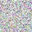

# Raycasting Engine

A simple raycasting engine written in **C++**, inspired by classic games like **Wolfenstein 3D**. This project demonstrates how to create a pseudo-3D environment using 2D techniques.



---

## Features

- 2D to 3D raycasting engine
- Player movement and input handling
- Scene rendering with wall textures
- Map parsing from plain text files
- Texture support (`.xpm`)
- Easily extendable map and scene system

---

## Project Structure

```bash
Raycasting-main/
├── include/           # Header files
├── src/               # Core engine and logic
├── maps/              # Level definitions
├── textures/          # Wall textures
├── main.cpp           # Application entry point
├── Makefile           # Build configuration
├── stb_image_write.h  # External image writing utility
├── output.png         # Sample render output
└── README.md          # Project documentation
```

Build Instructions
Prerequisites
A `C++17` compatible compiler (e.g., **g++, clang++**)

`make`

This will compile the project and create an executable in the root directory.

Running the Program
After compilation, you can run the program using:
`./rc`


# Maps
You can find several predefined maps in the `maps/` directory. Each map file represents a 2D grid that the engine interprets for wall positions.

# Textures
Textures are stored in the textures/ directory in .xpm or .raw format.Texture mapping using basic linear algebra (vectors, angles)

# Concepts Used **Raycasting algorithm**


# License
This project is licensed under the terms of the LICENSE file provided in the repository.


# Authors
Developed by [Hrant Hovhannisyan](https://github.com/TheOlifve) and [Armen Balagyozyan](https://github.com/gaxkalik) — feel free to contribute or fork!

# Contact
For questions, email [gaxkalik@gmail.com](gaxkalik@gmail.com) or [hrant.hovhannisyan2413@gmail.com](hrant.hovhannisyan2413@gmail.com).
